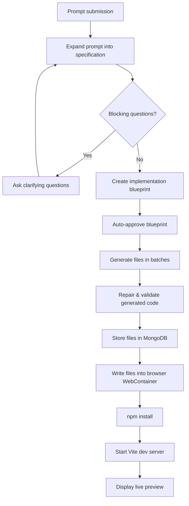
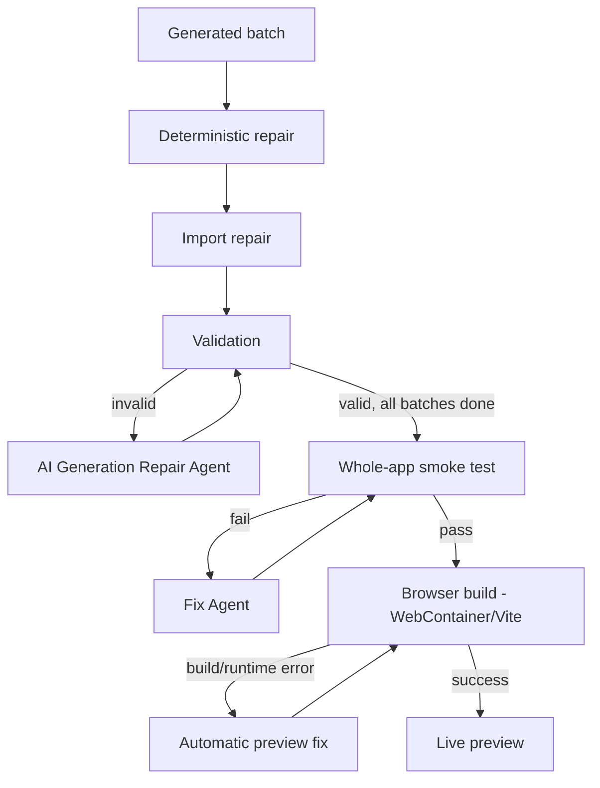

# ForgeAI Backend — Architecture & Generation Pipeline

This document describes how a user prompt turns into a running, previewable React application inside ForgeAI: the request pipeline, the file-generation batching system, and the multi-layer repair system that keeps generated code valid.

---

## Table of Contents

- [High-Level Pipeline](#high-level-pipeline)
- [Stage-by-Stage Flow](#stage-by-stage-flow)
  1. [User Presses Send](#1-user-presses-send)
  2. [Frontend Sends the Expansion Request](#2-frontend-sends-the-expansion-request)
  3. [Express Routes the Request](#3-express-routes-the-request)
  4. [Backend Expands the Prompt](#4-backend-expands-the-prompt)
  5. [Clarification Branch](#5-clarification-branch)
  6. [Blueprint Creation](#6-blueprint-creation)
  7. [Blueprint Approval](#7-blueprint-approval)
  8. [Start File Generation](#8-start-file-generation)
  9. [Generate Files in Batches](#9-generate-files-in-batches)
  10. [One Generation Batch](#10-one-generation-batch)
  11. [Repair & Validation](#11-repair--validation)
  12. [Whole-Project Validation](#12-whole-project-validation)
  13. [Load Files into the Browser](#13-load-generated-files-into-the-browser)
- [Repair System (Deep Dive)](#repair-system-deep-dive)
- [Full Function Call Chain](#full-function-call-chain)
- [Key Files Reference](#key-files-reference)

---

## High-Level Pipeline



Every stage below maps directly onto one node in this diagram.

---

## Stage-by-Stage Flow

### 1. User Presses Send

**File:** `forgeai-frontend/src/components/ChatWorkspace.jsx:353`

```js
const submit = async (event) => {
  event.preventDefault();
  const text = prompt.trim();
  const activeChatId = await ensureChat();

  await dispatch(addUserMessage({ chatId: activeChatId, content: text })).unwrap();

  const expanded = await dispatch(
    expandProjectStream({ chatId: activeChatId, prompt: text })
  ).unwrap();
};
```

Call chain:

```
submit()
  → ensureChat()
  → addUserMessage()
  → expandProjectStream()
```

> **Branch (line 362):** `if (approved && project.generatedFiles.length)` — if an app was already generated in this chat, the new message is treated as an **edit/explanation request**, not a fresh generation.

---

### 2. Frontend Sends the Expansion Request

**File:** `forgeai-frontend/src/services/apiClient.js:104`

```js
expandProjectStream: ({ chatId, prompt, image, onToken }) => {
  const formData = new FormData();
  formData.set('chatId', chatId);
  formData.set('prompt', prompt);

  return streamRequest(
    '/api/projects/expand/stream',
    { method: 'POST', body: formData },
    { onToken }
  );
}
```

```
POST /api/projects/expand/stream
Content-Type: multipart/form-data
```

Uses **SSE (Server-Sent Events)** so the backend can stream progress/tokens back to the UI as it works.

---

### 3. Express Routes the Request

**File:** `forgeai-backend/routes/projectRoutes.js:34`

```js
router.post('/expand/stream', uploadImage.single('image'), expandProjectStream);
```

Mounted in `forgeai-backend/app.js:21`:

```js
app.use('/api/projects', projectRoutes);
```

Full endpoint: `/api/projects` + `/expand/stream` = **`/api/projects/expand/stream`**

Middleware chain before the controller:

```
Express
  → JSON / CORS / activity middleware
  → projectRoutes
  → requireVisitor middleware
  → uploadImage.single("image")
  → expandProjectStream controller
```

---

### 4. Backend Expands the Prompt

**File:** `forgeai-backend/controllers/projectController.js:51`

```js
export async function expandProjectStream(req, res) {
  startSse(res);

  const chatId = String(req.body.chatId || '').trim();
  const prompt = String(req.body.prompt || '').trim();

  const chat = await findVisitorChat(chatId, req.visitorId);
  const imageDescription = await describeImage(req.file);

  const expandedSpec = await expandSpecification({ prompt, imageDescription, onToken });

  const project = await Project.create({
    projectId: randomUUID(),
    originalPrompt: prompt,
    expandedSpec,
    status: 'spec_ready'
  });

  writeSse(res, 'final', { project });
}
```

This stage:
1. Validates the prompt and visitor.
2. Converts the raw prompt into a **detailed specification**.
3. Creates a `Project` database record.

Call chain:

```
expandProjectStream()
  → expandSpecification()
  → runExpansionGraph()
  → expansionNode()
  → buildExpansionPrompt()
  → callStructuredAgent()
  → callOpenAI()
  → fetchLlmResponse()
```

**`expandSpecification()`** — `forgeai-backend/services/ai/aiClient.js:3`

```js
export async function expandSpecification({ prompt, imageDescription, onToken }) {
  return runExpansionGraph({
    prompt,
    imageDescription,
    fallback: mockExpansion(prompt, imageDescription),
    onToken
  });
}
```

**LangGraph definition** — `forgeai-backend/services/ai/langGraphAgent.js:40`

```
START → expansion_agent → END
```

The LLM returns a structured specification containing:

- `projectName`, `projectSummary`
- `pages`, `coreFeatures`
- `dataRequirements`
- `assumptions`, `blockingQuestions`

> If OpenAI is disabled or its response fails validation, `mockExpansion()` provides a local, deterministic fallback so the pipeline never hard-fails at this stage.

---

### 5. Clarification Branch

Back in `submit()`:

```js
const questions = blockingQuestionsFrom(expanded.project);

if (questions.length) {
  addClarificationQuestion(...);
  return;
}
```

**File:** `forgeai-frontend/src/components/ChatWorkspace.jsx:421`

```
Expanded specification
        |
        ├─ has blocking questions
        │    → show questions
        │    → user answers
        │    → answerClarification()
        │    → expandProjectStream() again
        │
        └─ no blocking questions
             → continueToPlanning()
```

When all clarification answers are collected, `answerClarification()` merges them with the original prompt and re-runs specification expansion.

---

### 6. Blueprint Creation

```js
await continueToPlanning(expanded.project, '');
```

```js
dispatch(planProjectStream({
  projectId: planningProject.projectId,
  specification: planningProject.expandedSpec,
  clarification
}))
```

```
POST /api/projects/plan/stream
```

```js
const blueprint = await planFrontendProject({ specification, clarification, onToken });
```

Full chain:

```
continueToPlanning()
  → planProjectStream (Redux thunk)
  → apiClient.planProjectStream()
  → POST /api/projects/plan/stream
  → controller planProjectStream()
  → planFrontendProject()
  → runPlanningGraph()
  → planningNode()
  → buildPlanningPrompt()
  → callStructuredAgent()
  → OpenAI / fallback
```

The resulting **blueprint** describes: exact file list, pages, components, dependencies, generation phases, and acceptance criteria.

```js
project.blueprint = blueprint;
project.status = 'planned';
await project.save();
```

---

### 7. Blueprint Approval

The current frontend **auto-approves** the blueprint — there is no manual pause by default:

```js
if (planned.project?.approvalStatus !== 'approved') {
  const approvedProject = await dispatch(updateApproval({
    projectId: planned.project.projectId,
    approvalStatus: 'approved'
  })).unwrap();

  await runGeneration(approvedProject.project.projectId);
}
```

```
PATCH /api/projects/:projectId/approval
```

> Approval-related UI/functions exist in the codebase, but the default initial flow does not pause for manual review.

---

### 8. Start File Generation

**File:** `forgeai-frontend/src/components/ChatWorkspace.jsx:479`

```js
await dispatch(generateProjectStream({
  projectId,
  onFiles: ({ generationProgress, currentBatch }) => {
    // update progress display
  }
})).unwrap();
```

```
POST /api/projects/:projectId/generate/stream
```

```js
router.post('/:projectId/generate/stream', generateProjectStream);
```

```js
const generated = await generateProjectFiles(project, {
  onFiles: async (files, current) => {
    writeSse(res, 'files', {
      files,
      generationStatus: current.generationStatus,
      generationProgress: current.generationProgress,
      currentBatch: current.currentBatch
    });
  }
});
```

---

### 9. Generate Files in Batches

**File:** `forgeai-backend/services/generation/codeGenerationService.js:17`

```js
export async function generateProjectFiles(project, options = {})
```

```
generateProjectFiles()
  → buildGenerationBatches()
  → buildProjectManifest()
  → buildAgentExecutionStages()
  → runGenerationBatch()   [for every batch]
  → repairGenerationBatch()
  → commitGeneratedFiles()
  → final project validation
  → save project
```

```js
const batches = buildGenerationBatches(project.blueprint || {});
const manifest = buildProjectManifest(project.blueprint || {}, batches);
const stages = buildAgentExecutionStages(batches);
```

Typical batch layout:

| Batch | Contents |
|---|---|
| 1 | `package.json`, Vite / Tailwind configuration |
| 2 | Mock data and shared utilities |
| 3 | Reusable UI components |
| 4 | Layout and navigation |
| 5 | Pages |
| 6 | `App.jsx` and `main.jsx` integration |

Independent batches can run **concurrently**; dependent batches run **sequentially**, based on the dependency graph produced during planning.

---

### 10. One Generation Batch

```
runGenerationBatch()
  → retrieveVerifiedFixes()
  → mockGenerateBatch()          [fallback]
  → runCodeGenerationGraph()
  → codeGenerationNode()
  → buildCodeGenerationPrompt()
  → callStructuredAgent()
  → OpenAI
```

The generation prompt receives:

- Expanded specification
- Blueprint
- Previously generated files
- Current target file paths
- Contracts between batches
- Warnings
- Dependency context
- Known previous pitfalls
- Project manifest

Expected model output:

```json
{
  "files": [
    { "path": "src/App.jsx", "content": "...complete source code..." }
  ],
  "contracts": [],
  "warnings": []
}
```

Files outside the assigned batch are discarded:

```js
generated.files = returnedFiles.filter((file) =>
  assigned.has(normalizeProjectPath(file.path))
);
```

This prevents one generation agent from unexpectedly overwriting another agent's files.

---

### 11. Repair & Validation

Every batch passes through `repairGenerationBatch(...)`:

```
runDeterministicRepairs()
  → repairMissingRelativeImports()
  → runDeterministicRepairs()      [again]
  → validateGenerationBatch()
  → validateBatchGraph()
```

If validation still fails:

```
runGenerationRepairGraph()
  → generationRepairNode()
  → buildGenerationRepairPrompt()
  → OpenAI repair response
  → validate again
```

Retries up to **3 attempts**.

After a valid batch, `commitGeneratedFiles()`:

- Merges new files with existing files
- Repairs imports
- Performs static validation
- Updates the dependency graph
- Saves `generatedFiles` to the `Project`
- Streams changed files/progress to the frontend

---

### 12. Whole-Project Validation

After all batches complete:

```js
project.generatedFiles = repairProjectFiles(...);
validateGeneratedFiles(project.generatedFiles);
project.dependencyGraph = runStaticValidation(...).graph;

let smokeRenderTest = runSmokeRenderTests(...);
```

If the smoke/render test fails:

```js
await runFixLoop(project, {
  runtimeOutput: 'Smoke/render test failed...',
  maxAttempts: 3
});
```

Status progression:

```
preparing → generating_batch → validating → storing → ready_for_preview
```

On unrecoverable failure, the last known-good state is restored:

```js
project.generationStatus = 'failed';
project.generationError = error.message;
// project.generatedFiles reverts to lastValidProjectFiles
```

---

### 13. Load Generated Files into the Browser

```js
const snapshot = await dispatch(fetchProject(projectId)).unwrap();
await writeGeneratedFiles(snapshot.project.generatedFiles);
```

**File:** `forgeai-frontend/src/components/ChatWorkspace.jsx:486`
**Function:** `forgeai-frontend/src/services/progressiveWebContainerService.js:13`

```
writeGeneratedFiles()
  → preparePreviewEnvironment()
  → setup()
  → boot()
  → getWebContainer()
  → mount base React/Vite template
  → validate generated file paths
  → validate required files
  → validate relative imports
  → write files into WebContainer filesystem
  → sanitize package.json
  → npm install --ignore-scripts
  → optionally npm run build
  → npm run dev -- --host 0.0.0.0
  → wait for WebContainer server-ready
  → return preview URL
```

Required generated files:

```
package.json
index.html
src/main.jsx
src/App.jsx
src/index.css
```

The browser-side WebContainer runs:

```bash
npm install --ignore-scripts
npm run dev -- --host 0.0.0.0
```

When Vite emits **server-ready**, the preview URL is stored and rendered by `PreviewPanel`.

---

## Repair System (Deep Dive)

There are effectively **two AI repair systems**, plus deterministic repairs on either side of them:



### 1. Deterministic Repairs

**File:** `forgeai-backend/services/generation/codeGenerationService.js:173`

```js
runDeterministicRepairs(...)
repairMissingRelativeImports(...)
runDeterministicRepairs(...)
```

Rule-based, no LLM involved. Fixes predictable issues: missing routes, integration mistakes, broken relative imports.

### 2. AI Generation Repair Agent

If a batch still fails validation after deterministic repair:

```js
runGenerationRepairGraph(...)
```

**Graph:** `forgeai-backend/services/ai/langGraphAgent.js:61`

```
START → generation_repair_agent → END
```

Receives:
- Generated files that failed
- Validation error
- Target file list
- Previously generated files
- Blueprint and specification
- Import/dependency context

Retries up to 3 times:

```js
for (let attempt = 1; attempt <= maxAttempts; attempt += 1)
```

### 3. Whole-Project Fix Agent

Runs once all batches are assembled:

```js
let smokeRenderTest = runSmokeRenderTests(project.generatedFiles);

if (!smokeRenderTest.passed) {
  await runFixLoop(project, {
    runtimeOutput: 'Smoke/render test failed...',
    maxAttempts: 3
  });
}
```

**Implementation:** `forgeai-backend/services/review/fixAgent.js`

### 4. Browser-Preview Automatic Fix

Even after backend checks pass, Vite can surface a real build/runtime error in the WebContainer. The frontend catches this:

```js
try {
  await writeGeneratedFiles(files);
} catch (previewError) {
  await requestAutomaticPreviewFix(buildError);
}
```

**File:** `forgeai-frontend/src/components/ChatWorkspace.jsx:489`

The actual WebContainer/Vite error is sent back for another repair attempt.

### If All Repairs Fail

The last known-good state is preserved — a broken batch never silently overwrites a working project:

```js
project.generatedFiles = lastValidProjectFiles;
project.generationStatus = 'failed';
project.generationError = error.message;
```

### Summary Table

| Layer | Type | Trigger | Max Attempts | Scope |
|---|---|---|---|---|
| Deterministic repair | Rule-based | Every batch | N/A (always runs) | Single batch |
| Generation Repair Agent | AI (LangGraph) | Batch fails validation | 3 | Single batch |
| Fix Agent | AI | Whole-app smoke test fails | 3 | Whole project |
| Automatic preview fix | AI | WebContainer/Vite build error | Backend-driven | Whole project |

---

## Full Function Call Chain

The complete, successful end-to-end call chain:

```
ChatWorkspace.submit()
→ ensureChat()
→ addUserMessage()
→ expandProjectStream()
→ POST /api/projects/expand/stream
→ projectController.expandProjectStream()
→ expandSpecification()
→ runExpansionGraph()
→ expansionNode()
→ callStructuredAgent()
→ callOpenAI()

→ ChatWorkspace.continueToPlanning()
→ planProjectStream()
→ POST /api/projects/plan/stream
→ projectController.planProjectStream()
→ planFrontendProject()
→ runPlanningGraph()
→ planningNode()
→ callStructuredAgent()
→ callOpenAI()

→ updateApproval()
→ ChatWorkspace.runGeneration()
→ generateProjectStream()
→ POST /api/projects/:id/generate/stream
→ projectController.generateProjectStream()
→ generateProjectFiles()
→ buildGenerationBatches()
→ buildAgentExecutionStages()
→ runGenerationBatch()
→ runCodeGenerationGraph()
→ codeGenerationNode()
→ callStructuredAgent()
→ callOpenAI()
→ repairGenerationBatch()
→ commitGeneratedFiles()
→ validateGeneratedFiles()
→ runStaticValidation()
→ runSmokeRenderTests()
→ project.save()

→ fetchProject()
→ writeGeneratedFiles()
→ preparePreviewEnvironment()
→ WebContainer.boot()
→ wc.mount()
→ wc.fs.writeFile()
→ npm install
→ npm run dev
→ server-ready
→ PreviewPanel
```

---

## Key Files Reference

| File | Responsibility |
|---|---|
| `forgeai-frontend/src/components/ChatWorkspace.jsx` | Orchestrates the entire client-side flow: submit, clarification, planning, generation, preview |
| `forgeai-frontend/src/services/apiClient.js` | All backend API calls (expand/plan/generate/approval) |
| `forgeai-frontend/src/services/progressiveWebContainerService.js` | Boots the browser WebContainer and runs the generated app |
| `forgeai-backend/app.js` | Express app setup and route mounting |
| `forgeai-backend/routes/projectRoutes.js` | Route definitions for `/api/projects/*` |
| `forgeai-backend/controllers/projectController.js` | Request handlers: expand, plan, generate, approval |
| `forgeai-backend/services/ai/aiClient.js` | Entry points into the LangGraph-based AI agents |
| `forgeai-backend/services/ai/langGraphAgent.js` | LangGraph node/graph definitions (expansion, planning, generation, repair) |
| `forgeai-backend/services/ai/prompts/*` | Prompt builders: `buildExpansionPrompt`, `buildPlanningPrompt`, `buildCodeGenerationPrompt`, `buildGenerationRepairPrompt` |
| `forgeai-backend/services/generation/codeGenerationService.js` | Batch building, generation orchestration, deterministic repair, commit logic |
| `forgeai-backend/services/review/fixAgent.js` | Whole-project Fix Agent (post-assembly repair) |

---

## Notes / Known Behaviors

- **Auto-approval:** Blueprints are approved automatically in the default flow; manual-approval UI exists but is currently bypassed.
- **Graceful fallback:** Both expansion and generation have local mock fallbacks (`mockExpansion`, `mockGenerateBatch`) if the LLM is disabled or its response fails validation — the pipeline degrades rather than hard-failing.
- **Non-destructive failure:** If all repair layers fail, the project keeps its `lastValidProjectFiles` rather than being overwritten with broken output.
- **File ownership isolation:** Each generation batch can only write files it was explicitly assigned — files outside that set are filtered out before being merged into the project